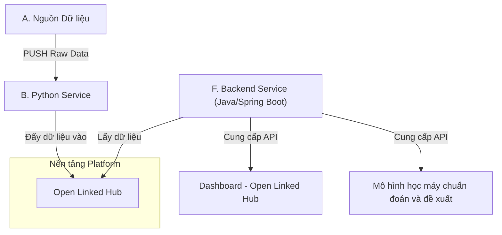

# Ldx-Insight (Bài dự thi Olympic Tin học 2025)

**Đội:** Haui.HIT-H2K  
**Trường:** Trường Công Nghệ Thông Tin và Truyền Thông (SICT) - Đại Học Công Nghiệp Hà Nội

[](https://haui-hit-h2k.github.io/Ldx-Insight/)
[](./LICENSE)

Bài dự thi **hạng mục Phần mềm nguồn mở 2025** với chủ đề _“Ứng dụng Dữ liệu mở Liên kết hỗ trợ chẩn đoán và đề xuất với mô hình học máy phục vụ Chuyển đổi số Địa phương”_.

---

## 💡 Ý tưởng Cốt lõi

Tại Việt Nam, các nguồn dữ liệu mở (như **data.gov.vn**, **opendata.mic.gov.vn**, ...) đang **phân tán**, **khó khai thác đồng bộ** và **thiếu công cụ phân tích**.

**Ldx-Insight (Local Digital Transformation Insight)** được xây dựng để giải quyết vấn đề này. Đây là một **nền tảng tích hợp dữ liệu**, tuân thủ **kiến trúc, công nghệ và giấy phép nguồn mở**, nhằm:

- **Thu thập (Collector):** Một script **Python** tự động thu thập dữ liệu từ các nguồn mở.  
- **Chuẩn hóa (Database):** Dữ liệu được làm sạch, chuẩn hóa về **JSON** và lưu trữ tập trung tại **MongoDB**.  
- **Cung cấp (Backend):** Lõi **Spring Boot 3 (Java 17)** cung cấp **REST API** bảo mật để truy vấn dữ liệu.  
- **Phân tích (Frontend/ML):**  
  - **Frontend (Nuxt.js)** cung cấp dashboard trực quan (biểu đồ, bảng).  
  - **ML Service (Python)** cung cấp API “chẩn đoán” các chỉ số chuyển đổi số.

Kiến trúc này tuân thủ **đầy đủ 4 nhóm yêu cầu** của đề thi: **Tích hợp**, **Hiển thị/Phân tích**, **Cung cấp API**, và **Học máy chẩn đoán**.

---

## 🏗️ Luồng hoạt động của hệ thống

Hệ thống hoạt động theo sơ đồ **data flow** dưới đây: 


---

## 🛠️ Công nghệ & Phụ thuộc (Tech Stack)

Nền tảng này sử dụng và tích hợp các công nghệ sau:

- **Backend (Code):** Spring Boot 3 (Java 17), Spring Security, Spring Data MongoDB, MapStruct.  
- **Frontend:** Nuxt.js (Vue.js 3).  
- **Database:** MongoDB.  
- **Data Collector:** Python (thư viện: `requests`, `pandas`).  
- **ML Service:** Python (FastAPI/Flask, scikit-learn).  
- **Tài liệu:** Docusaurus (Documentation site).  
- **Vận hành:** Docker & Docker Compose.

---


## 🌐 Các cổng (Port) mặc định

- **Giao diện Frontend (Demo):** http://localhost:3000  
- **Backend API (Swagger):** [http://api.haui-hit-h2k.site/swagger-ui.html ](http://api.haui-hit-h2k.site/swagger-ui/index.html#/1.%20Dataset%20APIs) 
- **ML Service (API):** http://localhost:5000 *(giả định)*  
- **Trang tài liệu :**https://haui-hit-h2k.github.io/Ldx-Insight/

**Dừng toàn bộ hệ thống (nếu dùng Docker Compose):**
```bash
docker-compose down
```

---

## 📚 Tài liệu Chi tiết

Tài liệu này chỉ là **tổng quan**. Toàn bộ mô tả chi tiết về **kiến trúc 3 lớp của Backend**, **thiết kế API**, **cấu trúc Model**, và **hướng dẫn sử dụng** đều có tại trang Docusaurus của dự án.

➡️ **Xem tài liệu đầy đủ tại đây:** https://haui-hit-h2k.github.io/Ldx-Insight/


---

## 🤝 Đóng góp cho Dự án (CONTRIBUTE)

Chúng mình rất hoan nghênh mọi đóng góp!

### Quy trình chung
1. **Fork** repo & tạo **nhánh tính năng**:
   ```bash
   git checkout -b feat/ten-tinh-nang
   ```
2. **Commit** theo chuẩn (ví dụ **conventional commits**):
   ```bash
   git commit -m "feat(api): bo sung endpoint tim kiem chi so"
   ```
3. **Push** nhánh và tạo **Pull Request (PR)** mô tả rõ ràng thay đổi & ảnh chụp (nếu có).
4. Đảm bảo:
   - Pass các bước **CI** (nếu có).  
   - Tuân thủ **code style** & **license header**.  
   - Cập nhật **docs**/**examples** nếu thay đổi hành vi.

### Báo lỗi & Đề xuất tính năng
- **Báo lỗi ⚠️:** [Tạo một Bug Report](https://github.com/Haui-HIT-H2K/ldx-insight/issues/new?assignees=&labels=bug&template=bug_report.md&title=%5BBUG%5D)  
- **Yêu cầu tính năng 👩‍💻:** [Đề xuất một tính năng mới](https://github.com/Haui-HIT-H2K/ldx-insight/issues/new?assignees=&labels=enhancement&template=feature_request.md&title=%5BFEAT%5D)

> Nếu bạn muốn đóng góp dài hạn, hãy xem thêm trong `CONTRIBUTING.md` (nếu có) hoặc mở một **Discussion** để trao đổi định hướng.

---

## 📞 Liên hệ

* **Nguyễn Huy Hoàng:** nguyenhuyhoangpt0402@gmail.com
* **Trần Danh Khang:** trandanhkhang482004@gmail.com
* **Nguyễn Huy Hoàng:** nguyenhuyhoangqbx5@gmail.com

---

## ⚖️ Giấy phép

Dự án này được cấp phép theo **Apache 2.0**. Xem chi tiết tại file [LICENSE](./LICENSE).
